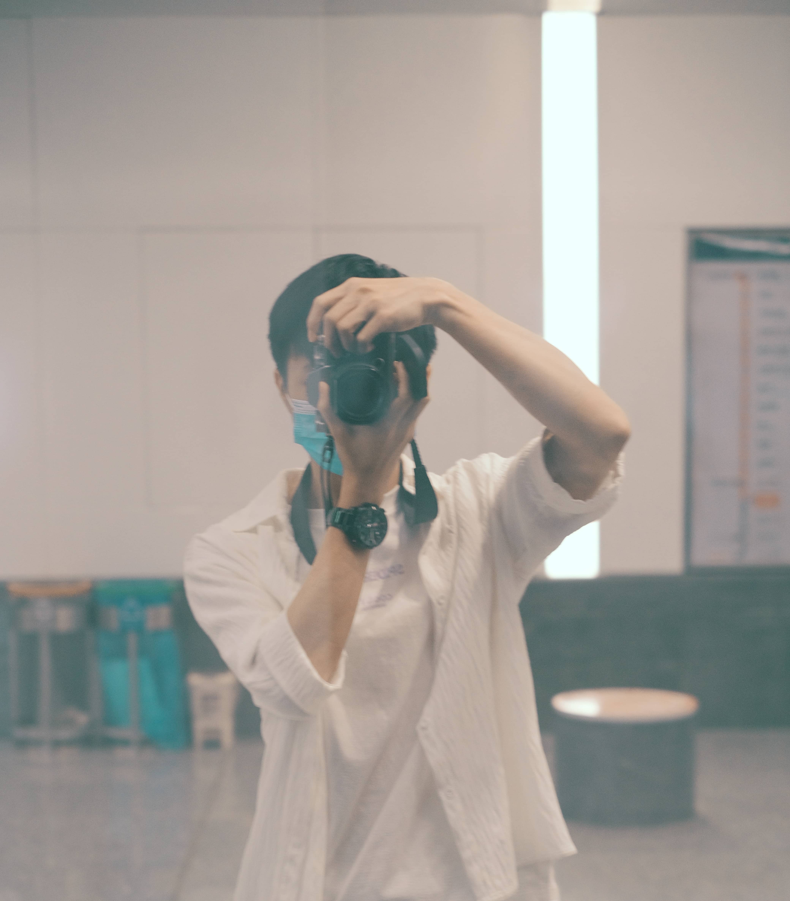
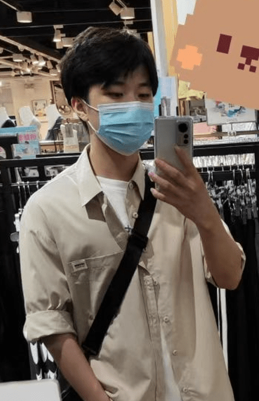

# 作者 & 赞助

## 作者信息

名称：奔跑的面条

描述：一位 99 年、喜欢代码、喜欢二次元、喜欢 LOL 大乱斗，个人比较贫穷的青年（B 站 6 级水军）

职位：前端开发攻城狮（切图仔）

  
  

开源项目：

- GoView 低代码大屏开发平台 ：**[go-view](https://gitee.com/MTrun/go-view)** 

- Vue2 大屏展示模板： **[vue-big-screen](https://gitee.com/MTrun/big-screen-vue-datav)** **6.6K+** ⭐
- Vue3 大屏展示模板： **[vue-big-screen-plugin](https://gitee.com/MTrun/vue-big-screen-plugin)** **1.6K+** ⭐
- React 大屏展示模板： **[react-big-screen](https://gitee.com/MTrun/react-big-screen)** **1K** ⭐
- Pinia 教学项目：**[pinia-demonstration](https://gitee.com/MTrun/pinia-demonstration)** ⭐
- Gitee 主页: **[https://gitee.com/MTrun](https://gitee.com/MTrun)** ⭐
- CSDN 主页: **[https://blog.csdn.net/qq_40282732](https://blog.csdn.net/qq_40282732)** **48W+** 😶‍🌫️ 访问量（很 💧，没啥好看的）

## 赞助

非常感谢您的支持，若此项目能给您带来帮助，我也很开心哒！

  
  

