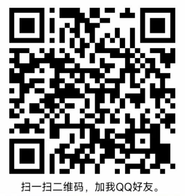
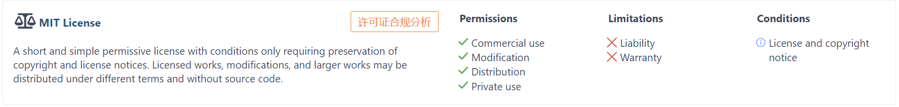

## 商用授权

商用授权请联系交流群群主-即作者本人


## 免责声明

任何企业或个人使用 GoView 原始项目或二次创作后，对自己或他人造成的任何形式的损失和伤害，GoView 作者不承担任何法律责任。

## 权益声明

本项目使用 `MIT` 开源协议，若要商用请注意 Logo（GoView 具有所有权），擅自使用将会造成侵权行为，产生法律纠纷 GoView 作者将追究责任。

任何使用者都需遵守 `MIT` 协议内容，保留项目声明（入口：右上角头像 ->关于软件 -> 弹窗内容）， 协议详细如下：



```js
MIT License

Copyright (c) 2021 奔跑的面条

Permission is hereby granted, free of charge, to any person obtaining a copy
of this software and associated documentation files (the "Software"), to deal
in the Software without restriction, including without limitation the rights
to use, copy, modify, merge, publish, distribute, sublicense, and/or sell
copies of the Software, and to permit persons to whom the Software is
furnished to do so, subject to the following conditions:

The above copyright notice and this permission notice shall be included in all
copies or substantial portions of the Software.

THE SOFTWARE IS PROVIDED "AS IS", WITHOUT WARRANTY OF ANY KIND, EXPRESS OR
IMPLIED, INCLUDING BUT NOT LIMITED TO THE WARRANTIES OF MERCHANTABILITY,
FITNESS FOR A PARTICULAR PURPOSE AND NONINFRINGEMENT. IN NO EVENT SHALL THE
AUTHORS OR COPYRIGHT HOLDERS BE LIABLE FOR ANY CLAIM, DAMAGES OR OTHER
LIABILITY, WHETHER IN AN ACTION OF CONTRACT, TORT OR OTHERWISE, ARISING FROM,
OUT OF OR IN CONNECTION WITH THE SOFTWARE OR THE USE OR OTHER DEALINGS IN THE
SOFTWARE.

```

