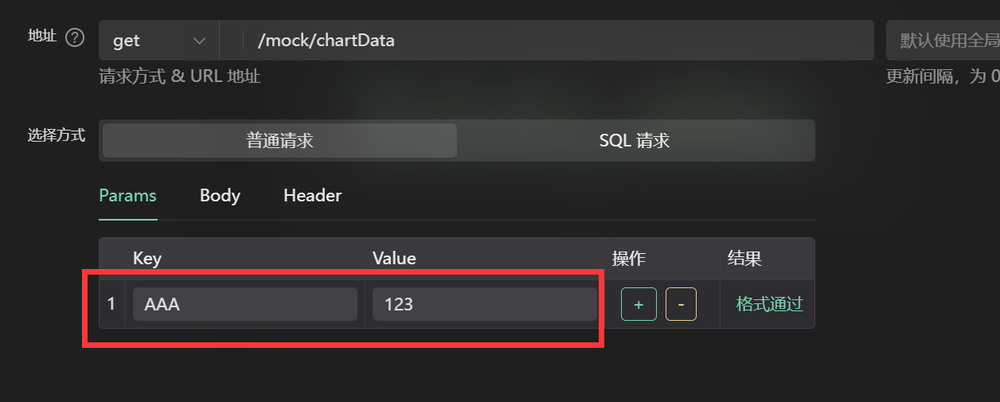
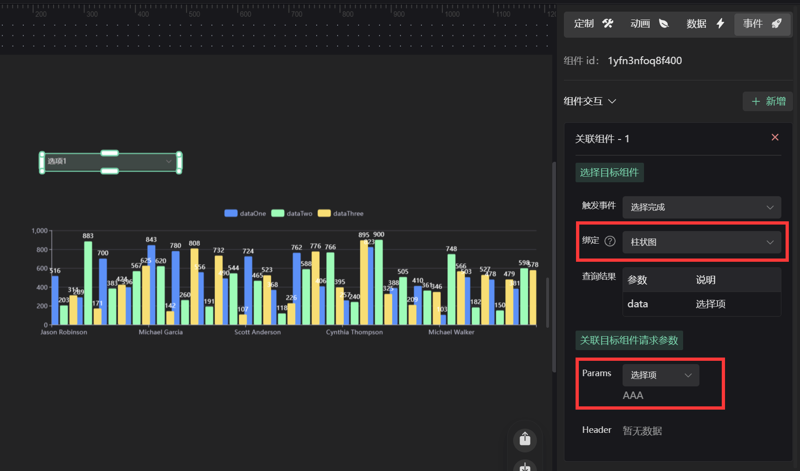
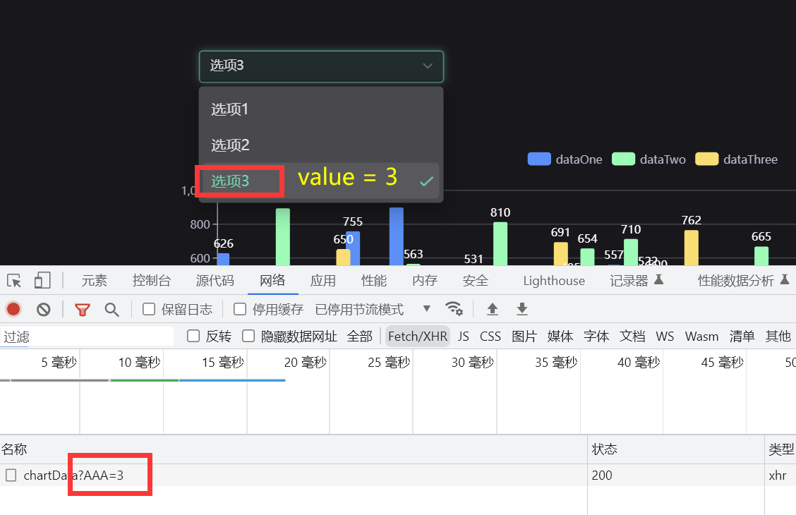
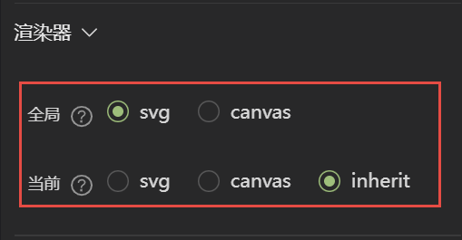
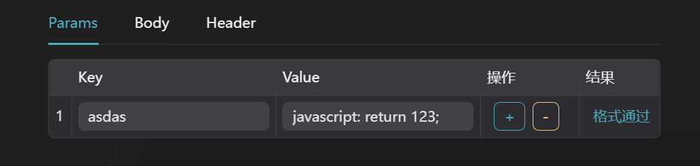
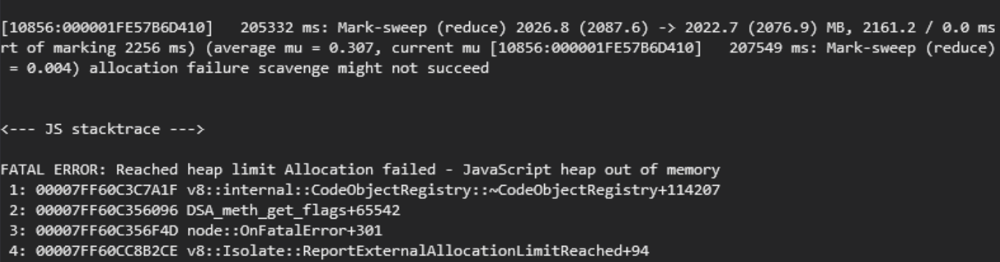
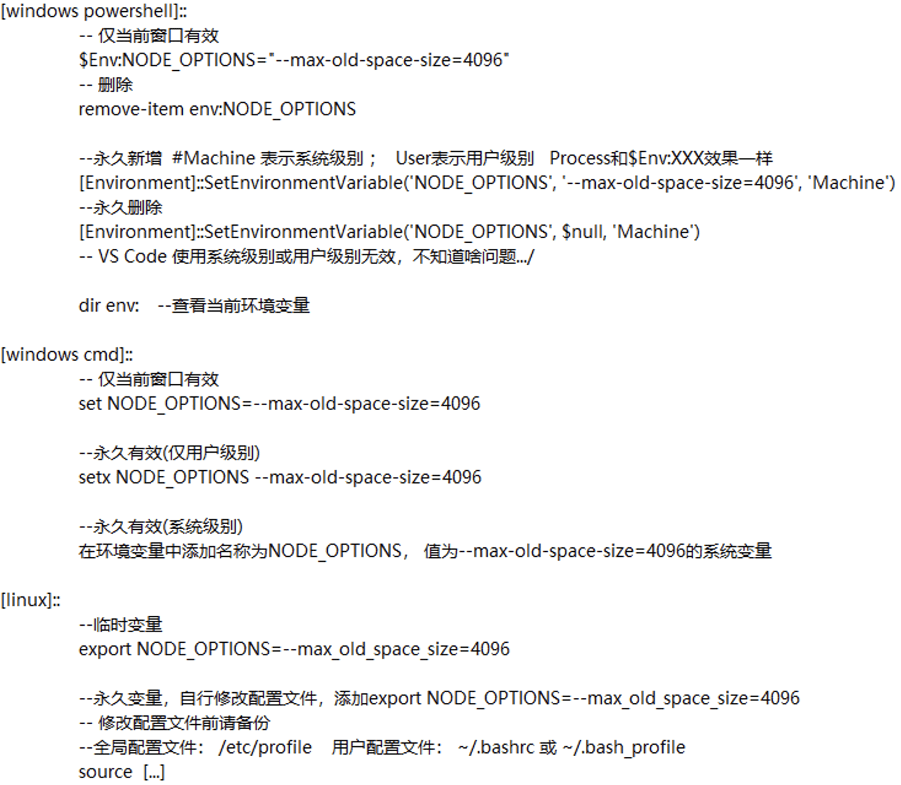

## 启动报错

现在不使用 `pnpm` 进行依赖安装会报错，请卸载旧依赖，并重新安装依赖。
如果还是不行就将 `node` 版本切换到 `16.14` 左右的版本，再尝试启动。

## 注意数据格式

为避免各类异常情况发生, config.ts -> option 中的数据源字段请务必使用: `dataset` 键名

## 创建矩形

GoView 没有专门的矩形，但是可以直接使用 `文字` 图表来进行矩形的创建。

- 将文本清空，X/Y 轴的内边距就是矩形的宽与高
- 背景就是矩形的颜色
- 圆角也是同理

## 使用联动组件

联动组件的使用前提是需要一个动态请求组件, 然后把联动组件更新动作回传的值给到动态请求的请求头里。现在支持的参数有限, 如果接口不兼容, 请后端配合一下。

比如先定义一个动态请求组件:



然后在左侧 `信息 -> 控件 -> 下拉选择器` 的拖拽到页面中,并选择 `事件 -> 新增交互`



预览的时候修改下拉选项就会去重新请求数据,并把最新选择数据放到参数中



## 预览模糊

- 屏幕的比例和定义的比例不一致的同时开启了滤镜功能
- 若展示的比例一致，开启滤镜则不会模糊
- 若需要使用滤镜功能，并且屏幕不固定，建议使用 Y 轴/X 轴滚动的适配方式
- 后期新增了 svg 和 canvas 的渲染方式, 默认 svg 会好很多



## 历史记录

历史记录不支持所有操作，当前支持数量有限，使用的时候需要注意，请不要无脑 `Ctrl + Z`。
若想了解当前步骤已经存储的内容，请在工作台底部左侧的 `历史记录` 里进行查看。

## 如何使用 SQL 类型

需要后端提供专门处理 SQL 语句的接口，key 前端为固定值，接口不支持 GET 类型。

## 请求动态获取值

请求配置里的 value 支持 js 语句分析:

:::danger
注意符合 js 语句格式, 只识别英文字符!
:::



```javascript
// 例子1
javascript：return 1;

// 例子2
javascript：let a=1; return a;

// 例子3（从全局取值）
javascript：return window.xxx;
```

## 获取路由的参数

路由里面如果添加了额外的参数，有快捷方式可以获取：

如：http://xxxxx/#/chart/home/xxxxxx?AAA=1&BBB=2

```javascript
// 获取参数
window.route.params
```

## 接口数据格式不对或提示参数错误或预览数据不会变化

数据格式最好和 mock 返回格式一致，mock 接口在开发环境能够看到并使用

```ts
declare interface MyResponseType {
  code: number
  msg: string
  data: any //数据能放在这里最好
}
```

**返回的数据需在 `data` 对象里，如果无法保证，请使用页面的【过滤器】来做提取处理，没有 `data` 字段，需从过滤器的 `res` 中去获取**

mock 接口：

- 【图表】/mock/chartData
- 【文本】/mock/text
- 【0~100 整数】/mock/number/int
- 【0~1 小数】/mock/number/float
- 【图片地址】/mock/image
- 【排名列表】/mock/rankList
- 【滚动表格】/mock/scrollBoard
- 更多具体看代码

## 关于 DataV

本项目部分组件基于 DataV 源码编写，如：边框，装饰，滚动图表等相关部分。
DataV 是基于 `MIT` 协议开源的大屏组件 UI 库，详见：[https://github.com/DataV-Team/Datav](https://github.com/DataV-Team/Datav)。之所以进行重写主要是因为 `DataV` 对 `Vue3` 支持的不够友好，只能照着源码二次开发。

由于时间限制，部分图表还没完全重写过来，如有需要可能需要自行重写。

## 后端部署问题

请添加反馈群，并查看群文档中的视频教程


## 关于打包失败

如果您没有修改过内存的大小，打包的时候会出现内存溢出的情况，是因为 node 默认的打包空间是 1G，但是在编译的时候是有概率超过 1G 空间大小的。报错如下图所示：


解决方法：修改 node 可用空间



## 关于 Win 平台动画失效修复

打开 Windows 的性能选项, 勾选 [调整为最佳外观]。

```
按 win + q 或 win + r，搜 %windir%\system32\SystemPropertiesPerformance.exe 即可打开 [性能选项] 窗口
```
